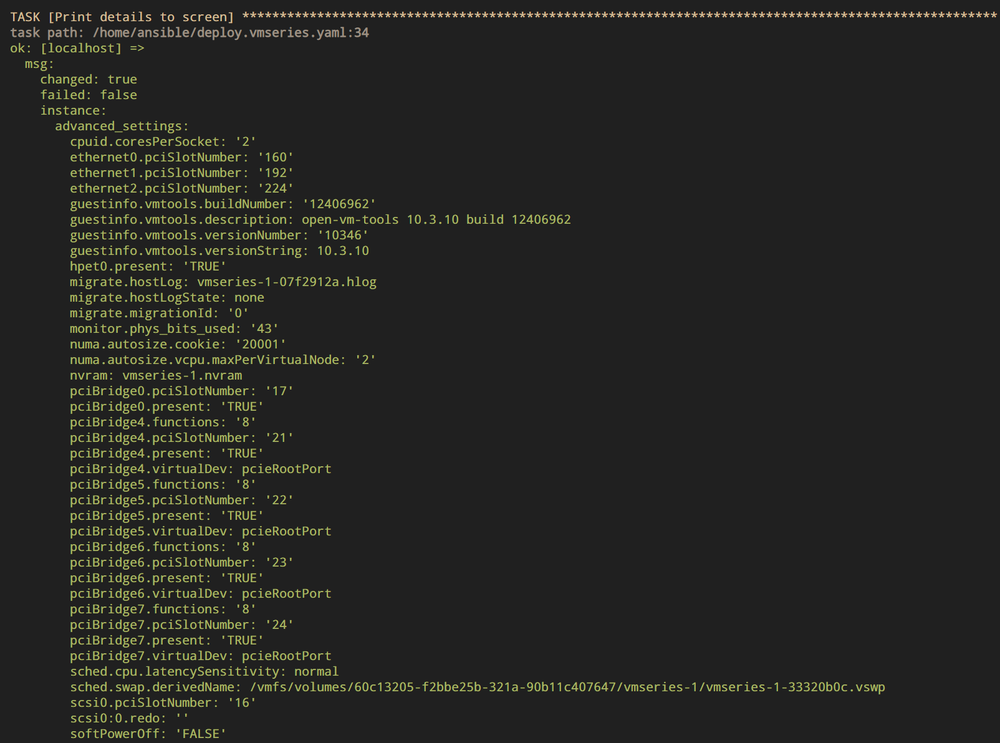

# Ansible Automation Example: Deploy Palo Alto VM series on VMware

[](https://docs.paloaltonetworks.com/vm-series)

## Overview

This example will show how to deploy a Palo Alto vmseries on VMware vCenter.

In addition to the Ansible playbok, this project also ships with additional tools to help you along your way. You will find a Dockerfile for running the project in an isolated environment, and a Makefile for those of us that hate typing out everything all the time.

## 🚀 `Executing the playbook`

This project provides two unique methods of executing the playbook:

1. Docker
2. Your own Python environment

### 🐳 `Docker`

#### With Invoke installed on your machine

If you have [invoke](https://pypi.org/project/invoke/) installed, you can use these two commands to build the container and run the playbook.

1. build the container image with

```bash
invoke build
```

2. run the playbook to deploy a new VM

```bash
invoke ansible
```

#### Without Invoke installed on your system

1. build the container image with

```bash
$ docker build -t ghcr.io/cdot65/ansible-deploy-vmseries:0.0.1 docker/
```

2. run the playbook to push the network configuration changes

```bash
docker run -it \
            --rm \
            {DOCKER_IMG}:{DOCKER_TAG} ansible-playbook -vvv deploy.vmseries.yaml \
            -e vcenter_hostname='my-vcenter' \
            -e vcenter_username='my-username' \
            -e vcenter_password='my-password' \
            -e datacenter='my-datacenter' \
            -e folder='my-folder' \
            -e template='vmseries-template' \
            -e esxi_host='my-esx-host' \
            -e vm_name='vm-name'"
```

#### 〰️ `Notes about Docker`

If you are unsure if Docker is installed on your computer, then it's probably safe to suggest that it's not. If you're interested in learning more about the product, I encourage you to read a few blogs on the topic. A personal recommendation would be [Digital Ocean](https://www.digitalocean.com/community/tutorial_collections/how-to-install-and-use-docker#:~:text=Docker%20is%20an%20application%20that,on%20the%20host%20operating%20system.)

Some of the goodies placed in the `docker` folder are not relevant to our use case with Python. Feel free to delete them as you see fit, I simply wanted to share with you my Docker build process for all Palo Alto automation projects (including those based on Ansible). The world is your oyster and I won't judge you on whatever direction you take.

### 🐍 `Your own Python environment`

I have included a Poetry file for anyone saavy enough to take advantage. For the uninitiated, Poetry helps replicate Python environments between users with a single file. You'll need to have Poetry installed on your machine, for most users that will be solved with `pip install poetry`.

This is optional, I will share the methods of going with Poetry or without

1. install Python dependencies

1a. with Poetry

```bash
poetry install
```

1b. without Poetry

```bash
python3 -m venv venv
source venv/bin/activate
pip install -r docker/requirements.txt
```

2. change into Ansible directory

```bash
cd ansible
```

3. install official Ansible roles for Palo Alto devices and VMware

```bash
ansible-galaxy install paloaltonetworks.panos
ansible-galaxy collection install community.vmware
```

4. run your Ansible playbook

```bash
ansible-playbook pb.deploy.vmseries.yaml -i inventory.yaml
```

#### 〰️ `Notes about Python Virtual Environments`

Similar to Docker, if you are unsure if you're using Python Virtual Environment features, it is safe to suggest that you're not. You are _strongly_ recommended to using a Python Virtual Environment everywhere. You can really mess up your machine if you're too lazy and say "ehh, that seems like it's not important". It is. If it sounds like I'm speaking from experience, well I'll never admit to it.

If you're interested in learning more about setting up Virtual Environments, I encourage you to read a few blogs on the topic. A personal recommendation would be

- [Digital Ocean (macOS)](https://www.digitalocean.com/community/tutorials/how-to-install-python-3-and-set-up-a-local-programming-environment-on-macos)
- [Digital Ocean (Windows 10)](https://www.digitalocean.com/community/tutorials/how-to-install-python-3-and-set-up-a-local-programming-environment-on-windows-10)

## 📝 `Dependencies`

Refer to the Poetry Lock file located at [poetry.lock](poetry.lock) for detailed descriptions on each package installed.

## ⚙️ `How it works`

Let's take a second to do a nice John Madden play-by-play by visiting the documentation in the `files/docs/` directory.

| Name                                            | Description     |
| ----------------------------------------------- | --------------- |
| [deploy.vmseries.rst](docs/deploy.vmseries.rst) | Deploy vmseries |

## 〰️ `Just an FYI for Ansible AWX / Tower users`

You'll note that there is an `ansible.cfg` file found in the root of the project's directory, as well as a folder `roles/` to host the `requirements.yml` file.

The only purpose these serve is for Ansible Tower, which will look for these files when the project syncs from Gitlab/Github/Whatever, and Tower will auto-install the packages.

The `ansible.cfg` file will be the definitive for each Playbook (Template) execution, so super important to keep it here.

## 📸 `Screenshot`


